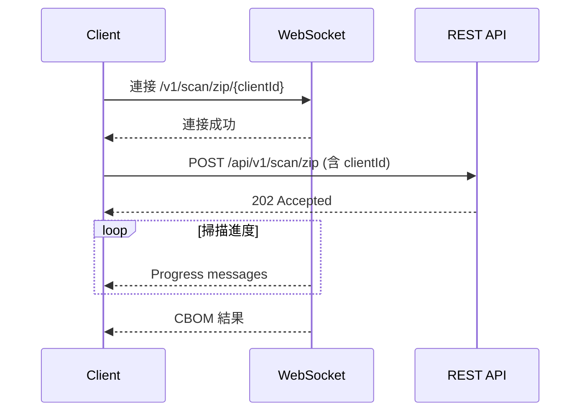

# CBOMkit WebSocket API Documentation

CBOMkit 提供 WebSocket API 用於即時掃描進度回報。

## 端點

### Git Repository 掃描
```
ws://host:port/v1/scan/{clientId}
```

### ZIP 檔案掃描
```
ws://host:port/v1/scan/zip/{clientId}
```

## 使用流程

### ZIP 掃描 (WebSocket 模式)



### 前端範例 (JavaScript)

```javascript
function scanZipWithProgress(file, projectName) {
    const clientId = crypto.randomUUID();
    const ws = new WebSocket(`ws://localhost:8081/v1/scan/zip/${clientId}`);
    
    ws.onopen = () => {
        const formData = new FormData();
        formData.append('file', file);
        formData.append('projectName', projectName);
        formData.append('clientId', clientId);
        
        fetch('/api/v1/scan/zip', { method: 'POST', body: formData });
    };
    
    ws.onmessage = (event) => {
        const msg = JSON.parse(event.data);
        handleMessage(msg);
    };
}

function handleMessage(msg) {
    switch (msg.type) {
        case 'LABEL':
            // 可能是進度 JSON 或純文字
            try {
                const progress = JSON.parse(msg.message);
                updateProgressBar(progress.stage, progress.progress, progress.message);
            } catch {
                console.log('Status:', msg.message);
            }
            break;
        case 'DETECTION':
            // 即時偵測到的加密元件
            const component = JSON.parse(msg.message);
            addDetectedComponent(component);
            break;
        case 'CBOM':
            const cbom = JSON.parse(msg.message);
            displayResults(cbom);
            break;
        case 'ERROR':
            showError(msg.message);
            break;
    }
}
```

---

## 訊息格式

所有 WebSocket 訊息為 JSON 格式：

```json
{
    "type": "MESSAGE_TYPE",
    "message": "content"
}
```

### 訊息類型

| Type | 說明 |
|------|------|
| `LABEL` | 進度狀態 (可能是 JSON 進度物件或純文字) |
| `DETECTION` | 即時偵測到的加密元件 (CycloneDX component JSON) |
| `FOLDER` | 解壓縮的資料夾路徑 |
| `SCANNED_FILE_COUNT` | 已掃描檔案數量 |
| `SCANNED_NUMBER_OF_LINES` | 已掃描程式碼行數 |
| `SCANNED_DURATION` | 掃描耗時 (秒) |
| `CBOM` | 最終 CBOM JSON 結果 (CycloneDX 格式) |
| `ERROR` | 錯誤訊息 |

---

## LABEL 訊息格式

LABEL 訊息的 `message` 欄位有兩種格式：

### 1. 進度 JSON (含階段和百分比)

```json
{"type":"LABEL","message":"{\"stage\":\"SCANNING\",\"progress\":65,\"message\":\"Scanning Java files...\"}"}
```

### 2. 純文字狀態

```json
{"type":"LABEL","message":"Extracted 100 files..."}
{"type":"LABEL","message":"Found project module 'sm-core' [336 .java files]"}
{"type":"LABEL","message":"Scanning java project sm-core (2/5)"}
```

---

## DETECTION 訊息格式

即時偵測到加密元件時發送：

```json
{
  "type": "DETECTION",
  "message": "{\"type\":\"cryptographic-asset\",\"bom-ref\":\"...\",\"name\":\"AES128-CBC-PKCS5\",\"evidence\":{...},\"cryptoProperties\":{...}}"
}
```

---

## 掃描階段與進度

| Stage | 進度 % | 說明 |
|-------|--------|------|
| `UPLOADING` | 5% | 上傳已接收 |
| `EXTRACTING` | 10-20% | 解壓縮 ZIP 檔案 |
| `INDEXING` | 30-40% | 索引 Java/Python 模組 |
| `SCANNING` | 50-85% | 掃描程式碼 |
| `GENERATING` | 90% | 產生 CBOM |
| `COMPLETED` | 100% | 掃描完成 |
| `FAILED` | 0% | 發生錯誤 |

### 進度時間軸

```
  5%  UPLOADING   - Upload received
 10%  EXTRACTING  - Extracting ZIP file...
 20%  EXTRACTING  - ZIP extracted
 30%  INDEXING    - Indexing modules...
 35%  INDEXING    - Indexing Java modules...
 40%  INDEXING    - Indexing Python modules...
 50%  SCANNING    - Starting code scan...
 55%  SCANNING    - Scanning Java files...
 70%  SCANNING    - Java scan complete: N files
 75%  SCANNING    - Scanning Python files...
 85%  SCANNING    - Python scan complete
 90%  GENERATING  - Generating CBOM...
100%  COMPLETED   - Scan finished
```

---

## 錯誤處理

發生錯誤時會收到：

```json
{"type":"ERROR","message":"No files found to scan in the project"}
{"type":"LABEL","message":"{\"stage\":\"FAILED\",\"progress\":0,\"message\":\"Error message\"}"}
```

---

## REST API (同步模式)

不需要即時進度時可直接使用：

```bash
curl -X POST http://localhost:8081/api/v1/scan/zip \
    -F "file=@myproject.zip" \
    -F "projectName=my-project"
```

回應為完整的 CBOM JSON (CycloneDX 格式)。
